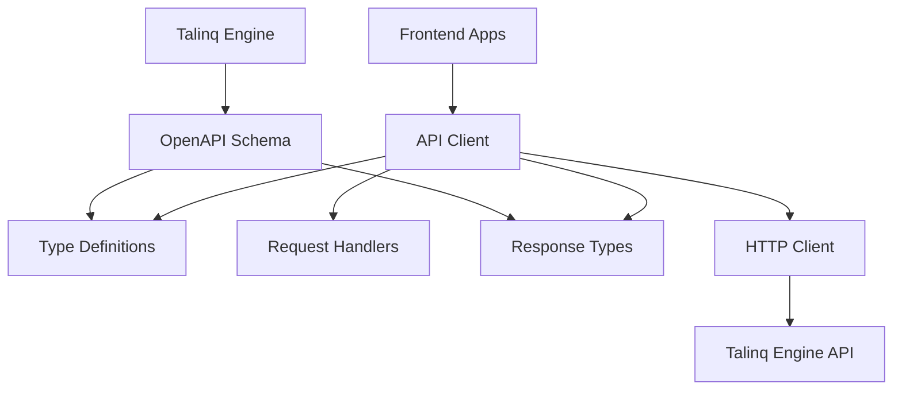

# 🔌 Talinq API

The API client package for Talinq, providing type-safe client definitions, request/response types, and utilities for communicating with the Talinq Engine API. This package ensures consistent API interactions across the frontend applications.

## 🚀 Features

- **🔒 Type Safety**: Full TypeScript integration with API schemas
- **📡 Client Definitions**: Pre-configured API client with Hono integration
- **🎯 Request/Response Types**: Comprehensive type definitions for all endpoints
- **⚡ Auto-completion**: IntelliSense support for API methods
- **🔄 Sync with Backend**: Types automatically generated from OpenAPI schema
- **🛡️ Error Handling**: Standardized error types and handling
- **📦 Lightweight**: Minimal dependencies with tree-shaking support

## 🏗️ Architecture



## 📁 Project Structure

```
packages/api/
├── src/                      # Source files (if any)
├── types/                    # TypeScript type definitions
│   ├── auth.types.ts        # Authentication types
│   ├── user.types.ts        # User-related types
│   ├── organization.types.ts # Organization types
│   └── common.types.ts      # Common/shared types
├── client/                   # API client implementations
│   ├── auth.client.ts       # Auth API client
│   ├── user.client.ts       # User API client
│   └── base.client.ts       # Base client configuration
├── index.ts                 # Main exports
└── package.json            # Package configuration
```

## 🚀 Quick Start

### Installation

This package is automatically available in the monorepo workspace:

```typescript
// In any frontend app
import { 
  apiClient, 
  userApi, 
  authApi 
} from '@osmynt-core/api';

// Import types
import type { 
  User, 
  CreateUserRequest, 
  ApiResponse 
} from '@osmynt-core/api';
```

### Basic Usage

```typescript
import { userApi, authApi } from '@osmynt-core/api';

// Get current user
const user = await userApi.getCurrentUser();

// Create a new user
const newUser = await authApi.createUser({
  email: 'user@example.com',
  firstName: 'John',
  lastName: 'Doe'
});

// Update user preferences
await userApi.updateOnboardingPreferences({
  step: 2,
  preferences: { theme: 'dark' }
});
```

## 🔧 Core Components

### Base API Client

Centralized HTTP client with authentication and error handling:

```typescript
// base.client.ts
import { hc } from 'hono/client';
import type { ApiType } from '@osmynt-core/engine'; // Import from engine

export class BaseApiClient {
  private client: ReturnType<typeof hc<ApiType>>;
  private baseUrl: string;

  constructor(baseUrl: string = process.env.NEXT_PUBLIC_API_URL || 'http://localhost:3000') {
    this.baseUrl = baseUrl;
    this.client = hc<ApiType>(baseUrl);
  }

  // Set authentication token
  setAuth(token: string) {
    this.client = hc<ApiType>(this.baseUrl, {
      headers: {
        Authorization: `Bearer ${token}`
      }
    });
  }

  // Get the configured client
  get api() {
    return this.client;
  }
}

// Create singleton instance
export const apiClient = new BaseApiClient();
```

### Authentication API

Type-safe authentication methods:

```typescript
// auth.client.ts
import { apiClient } from './base.client';
import type { CreateUserRequest, User, ApiResponse } from '../types';

export class AuthApi {
  async createUser(data: CreateUserRequest): Promise<ApiResponse<User>> {
    const response = await apiClient.api.auth['create-user'].$post({
      json: data
    });
    
    if (!response.ok) {
      throw new Error('Failed to create user');
    }
    
    return response.json();
  }

  async getCurrentUser(): Promise<ApiResponse<User>> {
    const response = await apiClient.api.auth['current-user'].$get();
    
    if (!response.ok) {
      throw new Error('Failed to get current user');
    }
    
    return response.json();
  }

  async signOut(): Promise<ApiResponse<null>> {
    const response = await apiClient.api.auth.signout.$post();
    
    if (!response.ok) {
      throw new Error('Failed to sign out');
    }
    
    return response.json();
  }
}

export const authApi = new AuthApi();
```

### User API

User management operations:

```typescript
// user.client.ts
import { apiClient } from './base.client';
import type { 
  User, 
  UpdateUserRequest, 
  OnboardingPreferences, 
  ApiResponse 
} from '../types';

export class UserApi {
  async getCurrentUser(): Promise<ApiResponse<User>> {
    const response = await apiClient.api.users.current.$get();
    
    if (!response.ok) {
      throw new Error('Failed to get current user');
    }
    
    return response.json();
  }

  async updateUser(data: UpdateUserRequest): Promise<ApiResponse<User>> {
    const response = await apiClient.api.users.current.$put({
      json: data
    });
    
    if (!response.ok) {
      throw new Error('Failed to update user');
    }
    
    return response.json();
  }

  async updateOnboardingPreferences(
    data: OnboardingPreferences
  ): Promise<ApiResponse<User>> {
    const response = await apiClient.api.users['onboarding-preferences'].$put({
      json: data
    });
    
    if (!response.ok) {
      throw new Error('Failed to update onboarding preferences');
    }
    
    return response.json();
  }
}

export const userApi = new UserApi();
```

### Organization API

Organization management operations:

```typescript
// organization.client.ts
import { apiClient } from './base.client';
import type { 
  Organization, 
  CreateOrganizationRequest, 
  ApiResponse 
} from '../types';

export class OrganizationApi {
  async createOrganization(
    data: CreateOrganizationRequest
  ): Promise<ApiResponse<Organization>> {
    const response = await apiClient.api.organizations.$post({
      json: data
    });
    
    if (!response.ok) {
      throw new Error('Failed to create organization');
    }
    
    return response.json();
  }

  async getOrganization(id: string): Promise<ApiResponse<Organization>> {
    const response = await apiClient.api.organizations[':id'].$get({
      param: { id }
    });
    
    if (!response.ok) {
      throw new Error('Failed to get organization');
    }
    
    return response.json();
  }
}

export const organizationApi = new OrganizationApi();
```

## 📝 Type Definitions

### Common Types

```typescript
// common.types.ts
export interface ApiResponse<T = any> {
  success: boolean;
  data: T;
  message: string;
  status: 'success' | 'error' | 'warning' | 'info';
  timestamp: string;
  meta?: ResponseMeta;
}

export interface ResponseMeta {
  pagination?: PaginationMeta;
  total?: number;
  page?: number;
  limit?: number;
  hasNextPage?: boolean;
  hasPreviousPage?: boolean;
}

export interface PaginationMeta {
  page: number;
  limit: number;
  total: number;
  totalPages: number;
}

export interface ApiError {
  code: string;
  message: string;
  details?: Record<string, any>;
}
```

### User Types

```typescript
// user.types.ts
export interface User {
  id: string;
  email: string;
  firstName: string | null;
  lastName: string | null;
  avatar: string | null;
  onboardingCompleted: boolean;
  lastLoginAt: Date | null;
  createdAt: Date;
  updatedAt: Date;
}

export interface CreateUserRequest {
  email: string;
  firstName?: string;
  lastName?: string;
  clerkUserId?: string;
}

export interface UpdateUserRequest {
  firstName?: string;
  lastName?: string;
  avatar?: string;
  onboardingCompleted?: boolean;
}

export interface OnboardingPreferences {
  step?: number;
  preferences?: Record<string, any>;
  completedSteps?: string[];
}
```

### Organization Types

```typescript
// organization.types.ts
export interface Organization {
  id: string;
  name: string;
  domain: string | null;
  industry: string | null;
  size: string | null;
  createdAt: Date;
  updatedAt: Date;
}

export interface CreateOrganizationRequest {
  name: string;
  domain?: string;
  industry?: string;
  size?: string;
}

export interface UpdateOrganizationRequest {
  name?: string;
  domain?: string;
  industry?: string;
  size?: string;
}
```

### Authentication Types

```typescript
// auth.types.ts
export interface AuthUser {
  id: string;
  email: string;
  firstName: string | null;
  lastName: string | null;
  isAuthenticated: boolean;
}

export interface SignInRequest {
  email: string;
  password: string;
}

export interface SignUpRequest {
  email: string;
  password: string;
  firstName?: string;
  lastName?: string;
}

export interface AuthResponse {
  user: AuthUser;
  token: string;
  refreshToken: string;
}
```

## 🎯 Usage with React Hooks

### With TanStack Query

```typescript
// hooks/useCurrentUser.ts
import { useQuery } from '@tanstack/react-query';
import { userApi } from '@osmynt-core/api';

export function useCurrentUser() {
  return useQuery({
    queryKey: ['user', 'current'],
    queryFn: async () => {
      const response = await userApi.getCurrentUser();
      return response.data;
    },
    staleTime: 5 * 60 * 1000, // 5 minutes
  });
}
```

### With Mutations

```typescript
// hooks/useUpdateUser.ts
import { useMutation, useQueryClient } from '@tanstack/react-query';
import { userApi, type UpdateUserRequest } from '@osmynt-core/api';

export function useUpdateUser() {
  const queryClient = useQueryClient();
  
  return useMutation({
    mutationFn: (data: UpdateUserRequest) => userApi.updateUser(data),
    onSuccess: () => {
      queryClient.invalidateQueries({ queryKey: ['user', 'current'] });
    },
  });
}
```

### Error Handling

```typescript
// utils/api-error-handler.ts
import type { ApiError } from '@osmynt-core/api';

export function handleApiError(error: unknown): ApiError {
  if (error instanceof Error) {
    return {
      code: 'UNKNOWN_ERROR',
      message: error.message,
    };
  }
  
  return {
    code: 'NETWORK_ERROR',
    message: 'A network error occurred',
  };
}

// Usage in components
try {
  await userApi.updateUser(data);
} catch (error) {
  const apiError = handleApiError(error);
  toast.error(apiError.message);
}
```

## 🔧 Configuration

### Environment Variables

```typescript
// The API client automatically uses these environment variables
NEXT_PUBLIC_API_URL=http://localhost:3000    # API base URL
NEXT_PUBLIC_APP_URL=http://localhost:9876    # Frontend URL
```

### Authentication Setup

```typescript
// Setup authentication token from Clerk
import { useAuth } from '@clerk/nextjs';
import { apiClient } from '@osmynt-core/api';

function useApiAuth() {
  const { getToken } = useAuth();
  
  useEffect(() => {
    const setupAuth = async () => {
      const token = await getToken();
      if (token) {
        apiClient.setAuth(token);
      }
    };
    
    setupAuth();
  }, [getToken]);
}
```

## 🛠️ Development

### Adding New API Endpoints

1. **Update the engine API** (add new route/controller)
2. **Update types** in this package:
   ```typescript
   // types/new-feature.types.ts
   export interface NewFeature {
     id: string;
     name: string;
   }
   
   export interface CreateNewFeatureRequest {
     name: string;
   }
   ```

3. **Create API client**:
   ```typescript
   // client/new-feature.client.ts
   export class NewFeatureApi {
     async create(data: CreateNewFeatureRequest): Promise<ApiResponse<NewFeature>> {
       const response = await apiClient.api['new-feature'].$post({ json: data });
       if (!response.ok) throw new Error('Failed to create');
       return response.json();
     }
   }
   
   export const newFeatureApi = new NewFeatureApi();
   ```

4. **Export from index**:
   ```typescript
   // index.ts
   export { newFeatureApi } from './client/new-feature.client';
   export type * from './types/new-feature.types';
   ```

### Type Generation

Types can be automatically generated from the OpenAPI schema:

```bash
# Generate types from OpenAPI schema
bunx openapi-typescript http://localhost:3000/docs --output types/generated.ts
```

## 📦 Exports

```typescript
// Main exports
export * from './client/auth.client';
export * from './client/user.client';
export * from './client/organization.client';
export * from './client/base.client';

// Type exports
export type * from './types/common.types';
export type * from './types/user.types';
export type * from './types/organization.types';
export type * from './types/auth.types';

// API instances
export { apiClient } from './client/base.client';
export { authApi } from './client/auth.client';
export { userApi } from './client/user.client';
export { organizationApi } from './client/organization.client';
```

## 🔍 Troubleshooting

### Type Errors

```typescript
// Ensure proper type imports
import type { User, ApiResponse } from '@osmynt-core/api';

// Not this:
import { User, ApiResponse } from '@osmynt-core/api';
```

### Authentication Issues

```typescript
// Make sure to set auth token before making requests
await apiClient.setAuth(token);
const user = await userApi.getCurrentUser();
```

### Network Errors

```typescript
// Handle network errors properly
try {
  const response = await userApi.getCurrentUser();
  return response.data;
} catch (error) {
  console.error('API Error:', error);
  throw new Error('Failed to fetch user data');
}
```

## 🤝 Contributing

1. Follow the [main contributing guidelines](../../README.md#contributing)
2. Keep types in sync with backend API
3. Add proper error handling for all methods
4. Document new API methods with examples
5. Write tests for complex client logic

## 📄 License

This project is proprietary software. All rights reserved.

---

Built with ❤️ using [Hono](https://hono.dev) client
